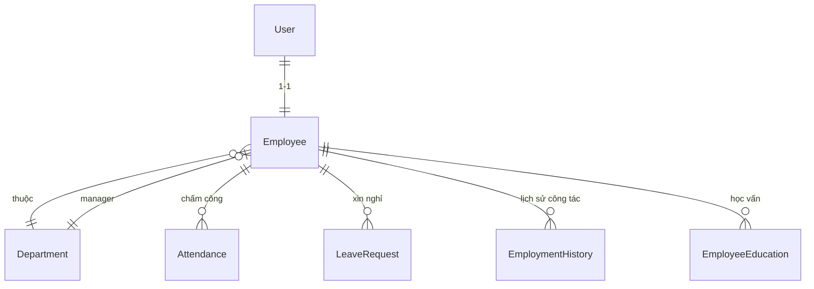
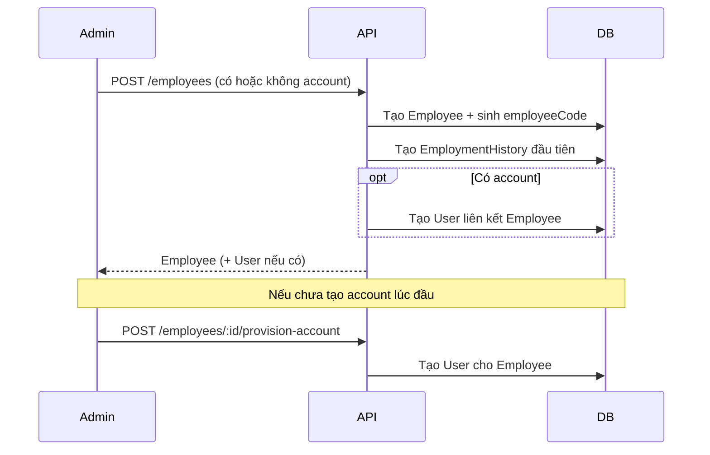
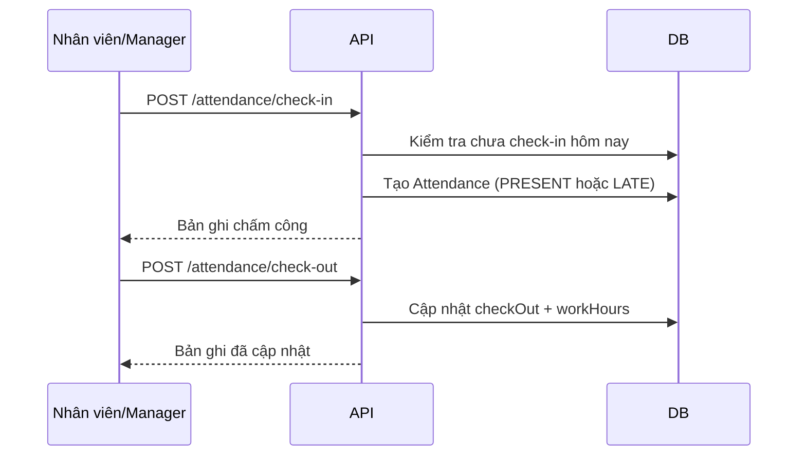
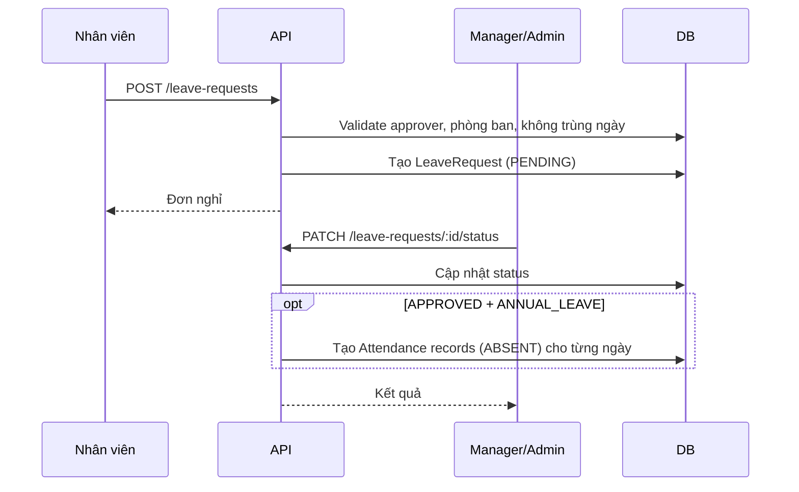

# Tổng quan hệ thống HRM — API & Logic nghiệp vụ

> Tài liệu này mô tả trạng thái hiện tại của backend NestJS tại thời điểm khảo sát codebase.  
> Base URL: **`/api/v1`** · Swagger: **`/api/docs`** (khi server chạy)

---

## Mục lục

1. [Kiến trúc tổng quan](#1-kiến-trúc-tổng-quan)
2. [Mô hình dữ liệu & quan hệ](#2-mô-hình-dữ-liệu--quan-hệ)
3. [Phân quyền (RBAC)](#3-phân-quyền-rbac)
4. [Định dạng response](#4-định-dạng-response)
5. [Danh sách API theo module](#5-danh-sách-api-theo-module)
6. [Logic nghiệp vụ chi tiết](#6-logic-nghiệp-vụ-chi-tiết)
7. [Đánh giá mức độ phù hợp MVP](#7-đánh-giá-mức-độ-phù-hợp-mvp)
8. [Vấn đề & khoảng trống cần lưu ý](#8-vấn-đề--khoảng-trống-cần-lưu-ý)

---

## 1. Kiến trúc tổng quan

| Thành phần | Mô tả |
|---|---|
| Framework | NestJS + TypeORM |
| Database | MySQL (qua `DatabaseModule`) |
| Auth | JWT Access Token (header) + Refresh Token (httpOnly cookie) |
| Guard toàn cục | `JwtAuthGuard` → `RolesGuard` |
| Validation | `ValidationPipe` (whitelist + transform) |
| Soft delete | Hỗ trợ qua `deletedAt` trên `BaseEntity` |

### Module đang hoạt động (`app.module.ts`)

| Module | Trạng thái |
|---|---|
| Auth | ✅ Hoàn chỉnh |
| Users | ⚠️ Một phần (không có API tạo/xóa user) |
| Employees | ✅ Hoàn chỉnh |
| Departments | ✅ Hoàn chỉnh |
| Attendance | ✅ Hoàn chỉnh |
| Leave Requests | ✅ Hoàn chỉnh (có điểm cần cải thiện) |
| Employee Histories | ✅ Hoàn chỉnh |
| Employee Educations | ⚠️ Hoàn chỉnh phần lớn (có bug nhỏ) |
| Employee Insurance | ❌ Scaffold — chưa có logic |
| Employee Benefit | ❌ Scaffold — chưa có logic |
| Payrolls | ❌ Scaffold — chưa có logic |

### Module/entity tồn tại nhưng chưa tích hợp

- **Shifts** (`src/modules/shifts/`): có entity nhưng **không import** vào `AppModule`, không có API.
- **Duplicate code** tại `src/employee-benefit/` và `src/employee-insurance/` (bản sao cũ, không dùng).

---

## 2. Mô hình dữ liệu & quan hệ



### Bảng chính

| Entity | Bảng | Mô tả |
|---|---|---|
| `UserEntity` | `User` | Tài khoản đăng nhập, gắn 1-1 với Employee |
| `EmployeeEntity` | `Employee` | Hồ sơ nhân viên |
| `DepartmentEntity` | `Department` | Phòng ban, có 1 manager duy nhất |
| `AttendanceEntity` | `Attendance` | Chấm công theo ngày (unique: employee + workDate) |
| `LeaveRequestEntity` | `LeaveRequest` | Đơn xin nghỉ phép |
| `EmploymentHistoryEntity` | `EmploymentHistory` | Lịch sử vị trí / phòng ban / lương |
| `EmployeeEducationEntity` | `EmployeeEducation` | Trình độ học vấn |
| `PayrollEntity` | (chưa định nghĩa cột) | Chỉ có scaffold |
| `EmployeeInsuranceEntity` | (chưa định nghĩa cột) | Chỉ có scaffold |
| `EmployeeBenefitEntity` | (chưa định nghĩa cột) | Chỉ có scaffold |

### Enum quan trọng

| Enum | Giá trị |
|---|---|
| `ERole` | `ADMIN`, `MANAGER`, `EMPLOYEE` |
| `EUserStatus` | `ACTIVE`, `INACTIVE`, `LOCKED` |
| `EEmployeeStatus` | `WORKING`, `RETIRED` |
| `EGenderType` | `MALE`, `FEMALE`, `OTHER` |
| `EAttendanceStatus` | `PRESENT`, `ABSENT`, `LATE`, `WORK_FROM_HOME` |
| `ELeaveRequestStatus` | `PENDING`, `APPROVED`, `REJECTED` |
| `ELeaveType` | `ANNUAL_LEAVE`, `UNPAID_LEAVE`, `OTHER` |

### Hằng số giờ làm việc

| Hằng số | Giá trị |
|---|---|
| Giờ bắt đầu | `08:30:00` |
| Giờ kết thúc | `17:30:00` |
| Nghỉ trưa | `12:00:00` – `13:00:00` |
| Giờ công chuẩn | `8` giờ/ngày |

---

## 3. Phân quyền (RBAC)

### Cơ chế

1. Mọi endpoint (trừ `@Public()`) yêu cầu header: `Authorization: Bearer <access_token>`.
2. Endpoint có `@Roles(...)` chỉ cho phép role tương ứng.
3. Endpoint **không** có `@Roles` → mọi user đã đăng nhập đều truy cập được.
4. Một số logic bổ sung trong service (ví dụ Manager chỉ xem nhân viên cùng phòng ban).

### Ma trận quyền tóm tắt

| Hành động | ADMIN | MANAGER | EMPLOYEE |
|---|---|---|---|
| Quản lý phòng ban | ✅ | ❌ | ❌ |
| Tạo/sửa nhân viên | ✅ | ❌ | ❌ |
| Xem danh sách nhân viên | ✅ (toàn công ty) | ✅ (phòng mình) | ❌ |
| Cập nhật profile cá nhân | ✅ | ✅ | ✅ |
| Chấm công check-in/out | ❌* | ✅ | ✅ |
| Xem chấm công toàn công ty | ✅ | ✅ (phòng mình) | ❌ |
| Tạo đơn nghỉ | ❌* | ✅ | ✅ |
| Duyệt đơn nghỉ | ✅ (nếu là approver) | ✅ (nếu là approver) | ❌ |
| Quản lý user | ✅ | ❌ | ❌ |

> *ADMIN thường không có bản ghi Employee liên kết, nên các API yêu cầu `actor.employee` sẽ không dùng được.

---

## 4. Định dạng response

Mọi response thành công đều qua `TransformInterceptor`:

```json
{
  "statusCode": 200,
  "message": "Thông báo từ @ResponseMessage",
  "data": { ... }
}
```

Danh sách có phân trang:

```json
{
  "data": {
    "result": [ ... ],
    "pagination": {
      "page": 1,
      "limit": 10,
      "total": 100,
      "totalPages": 10
    }
  }
}
```

---

## 5. Danh sách API theo module

### 5.1. App — `/api/v1/`

| Method | Endpoint | Auth | Mô tả |
|---|---|---|---|
| `GET` | `/` | Public | Health/hello |

---

### 5.2. Auth — `/api/v1/auth`

| Method | Endpoint | Auth | Role | Mô tả |
|---|---|---|---|---|
| `POST` | `/login` | Public | — | Đăng nhập (email + password), trả `access_token`, set cookie `refresh_token` |
| `GET` | `/get-account` | JWT | Tất cả | Lấy thông tin tài khoản + employee + department |
| `GET` | `/refresh-token` | Public (cookie) | — | Làm mới access token từ refresh token cookie |
| `POST` | `/logout` | JWT | Tất cả | Xóa refresh token cookie |
| `POST` | `/change-password` | JWT | Tất cả | Đổi mật khẩu (cần mật khẩu cũ) |

**Logic đăng nhập:**
- Chỉ user có `status = ACTIVE` mới đăng nhập được.
- Password so sánh qua bcrypt.
- Cập nhật `lastLogin` sau khi login thành công.

---

### 5.3. Users — `/api/v1/users`

| Method | Endpoint | Auth | Role | Mô tả |
|---|---|---|---|---|
| `GET` | `/all` | JWT | ADMIN | Danh sách user (phân trang, filter role/status/search) |
| `GET` | `/:id` | JWT | ADMIN | Chi tiết user |
| `PATCH` | `/:id` | JWT | ADMIN | Cập nhật role, status, displayName |

> **Lưu ý:** API `POST /users` (tạo user) và `DELETE /users/:id` đang bị **comment out**.  
> Tạo tài khoản hiện thực hiện qua `POST /employees` hoặc `POST /employees/:id/provision-account`.

---

### 5.4. Employees — `/api/v1/employees`

| Method | Endpoint | Auth | Role | Mô tả |
|---|---|---|---|---|
| `GET` | `/all` | JWT | ADMIN, MANAGER | Danh sách nhân viên (phân trang, filter) |
| `GET` | `/me` | JWT | EMPLOYEE, MANAGER | Hồ sơ nhân viên của chính mình |
| `POST` | `/` | JWT | ADMIN | Tạo nhân viên mới |
| `POST` | `/:id/provision-account` | JWT | ADMIN | Tạo tài khoản cho nhân viên chưa có user |
| `PATCH` | `/profile` | JWT | Tất cả | Cập nhật thông tin cá nhân (tên, SĐT, địa chỉ, avatar…) |
| `PATCH` | `/:id` | JWT | ADMIN | Cập nhật thông tin HR (phòng ban, vị trí, trạng thái, lương…) |

**Body tạo nhân viên (`POST /`):**

| Field | Bắt buộc | Mô tả |
|---|---|---|
| `firstName`, `lastName`, `gender`, `hireDate`, `position`, `departmentId`, `status`, `basicSalary` | ✅ | Thông tin cơ bản |
| `birthday`, `phone`, `address` | ❌ | Thông tin bổ sung |
| `account` | ❌ | `{ email, password, role }` — tạo user kèm theo |

**Logic tạo nhân viên:**
1. Kiểm tra phòng ban tồn tại.
2. Tự sinh `employeeCode` (format tuần tự).
3. Tạo bản ghi `Employee`.
4. Tạo `EmploymentHistory` đầu tiên (position, department, basicSalary, startDate = hireDate).
5. Nếu có `account`: tạo `User` liên kết; status user = ACTIVE nếu employee WORKING, ngược lại INACTIVE.

**Logic cập nhật nhân viên (`PATCH /:id`):**
- Đổi `status` employee → đồng bộ `status` user (ACTIVE/INACTIVE).
- Đổi `position` hoặc `departmentId` → đóng employment history hiện tại (`endDate = now`) và tạo history mới.

**Phân quyền danh sách:**
- ADMIN: xem toàn bộ, filter theo `departmentId`.
- MANAGER: chỉ xem nhân viên cùng `departmentId` với mình.

---

### 5.5. Departments — `/api/v1/departments`

| Method | Endpoint | Auth | Role | Mô tả |
|---|---|---|---|---|
| `POST` | `/` | JWT | ADMIN | Tạo phòng ban |
| `GET` | `/` | JWT | ADMIN | Danh sách phòng ban (phân trang) |
| `PATCH` | `/:id` | JWT | ADMIN | Cập nhật phòng ban |
| `DELETE` | `/:id` | JWT | ADMIN | Xóa mềm phòng ban |

**Logic gán manager:**
- `managerId` phải là employee có user với `role = MANAGER`.
- Mỗi manager chỉ được quản lý **một** phòng ban (unique constraint).
- Khi tạo/cập nhật, validate employee tồn tại và chưa là manager phòng khác.

---

### 5.6. Attendance — `/api/v1/attendance`

| Method | Endpoint | Auth | Role | Mô tả |
|---|---|---|---|---|
| `POST` | `/check-in` | JWT | EMPLOYEE, MANAGER | Check-in hôm nay |
| `POST` | `/check-out` | JWT | EMPLOYEE, MANAGER | Check-out hôm nay |
| `GET` | `/` | JWT | ADMIN, MANAGER | Danh sách chấm công (filter ngày, nhân viên, phòng ban, status) |
| `GET` | `/me` | JWT | EMPLOYEE, MANAGER | Lịch sử chấm công của bản thân |
| `PATCH` | `/:id` | JWT | ADMIN, MANAGER | Sửa chấm công (checkIn, checkOut, status) |

**Logic check-in:**
1. Employee phải `status = WORKING`.
2. Mỗi ngày chỉ check-in **một lần** (unique `employeeId + workDate`).
3. Ghi `checkIn` = giờ hiện tại.
4. Tự xác định status: `PRESENT` nếu ≤ 08:30, `LATE` nếu sau 08:30.

**Logic check-out:**
1. Phải đã check-in hôm nay.
2. Không check-out hai lần.
3. Tính `workHours` = thời gian làm việc thực tế, trừ giờ nghỉ trưa 12:00–13:00, giới hạn trong khung 08:30–17:30.

**Logic sửa chấm công (Manager/Admin):**
- Manager chỉ sửa được nhân viên cùng phòng ban.
- Validate checkOut > checkIn.
- Tự tính lại `workHours` và `status` khi đổi giờ.

**Query `GET /me`:** filter theo `year`, `month`, `day` (có validate phụ thuộc).

---

### 5.7. Leave Requests — `/api/v1/leave-requests`

| Method | Endpoint | Auth | Role | Mô tả |
|---|---|---|---|---|
| `POST` | `/` | JWT | EMPLOYEE, MANAGER | Tạo đơn xin nghỉ |
| `GET` | `/` | JWT | MANAGER, ADMIN | Danh sách đơn **gửi đến mình** (approver) |
| `GET` | `/me` | JWT | Tất cả | Đơn nghỉ của bản thân |
| `GET` | `/:id` | JWT | Tất cả | Chi tiết đơn (người tạo hoặc approver) |
| `PATCH` | `/:id` | JWT | EMPLOYEE, MANAGER | Sửa đơn PENDING của mình |
| `PATCH` | `/:id/status` | JWT | MANAGER, ADMIN | Duyệt / từ chối đơn |
| `DELETE` | `/:id` | JWT | EMPLOYEE, MANAGER | Xóa đơn PENDING của mình |

**Logic tạo đơn:**
1. `approverId` phải là employee đang WORKING, user ACTIVE, role ≠ EMPLOYEE (tức MANAGER hoặc ADMIN).
2. Người xin và approver phải **cùng phòng ban**.
3. MANAGER xin nghỉ → approver **bắt buộc** là ADMIN.
4. Không được tự duyệt chính mình.
5. `startDate` không quá 7 ngày trong quá khứ.
6. Không trùng khoảng thời gian với đơn PENDING/APPROVED khác.
7. Tự tính `numberOfDays` = số ngày giữa start và end (calendar days).

**Logic duyệt đơn (`PATCH /:id/status`):**
- Chỉ approver được chỉ định mới duyệt được.
- Chỉ duyệt đơn `PENDING`.
- Khi **APPROVED** + loại `ANNUAL_LEAVE`: tự tạo bản ghi `Attendance` cho từng ngày nghỉ với:
  - `checkIn = 08:30`, `checkOut = 17:30`, `workHours = 8`
  - `status = ABSENT` ← *cần xem xét lại semantics*

**Logic xóa:** chỉ xóa đơn PENDING do chính mình tạo.

---

### 5.8. Employee Histories — `/api/v1/employee-histories`

| Method | Endpoint | Auth | Role | Mô tả |
|---|---|---|---|---|
| `POST` | `/` | JWT | ADMIN | Tạo lịch sử công tác thủ công |
| `GET` | `/` | JWT | ADMIN, MANAGER | Danh sách (ADMIN: toàn công ty; MANAGER: phòng mình) |
| `GET` | `/me` | JWT | Tất cả | Lịch sử công tác của bản thân |
| `GET` | `/:id` | JWT | ADMIN, MANAGER | Chi tiết |
| `PATCH` | `/:id` | JWT | ADMIN | Cập nhật |
| `DELETE` | `/:id` | JWT | ADMIN | Xóa mềm |

**Mục đích:** Theo dõi thay đổi vị trí, phòng ban, lương cơ bản theo thời gian.  
Tự động tạo/cập nhật khi tạo nhân viên hoặc cập nhật position/department qua API Employees.

---

### 5.9. Employee Educations — `/api/v1/employee-educations`

| Method | Endpoint | Auth | Role | Mô tả |
|---|---|---|---|---|
| `POST` | `/` | JWT | ADMIN | Thêm học vấn cho nhân viên |
| `GET` | `/` | JWT | ADMIN, MANAGER | Danh sách (MANAGER: phòng mình) |
| `GET` | `/me` | JWT | Tất cả | Học vấn của bản thân |
| `GET` | `/:id` | JWT | ADMIN, MANAGER | Chi tiết |
| `PATCH` | `/:id` | JWT | ADMIN | Cập nhật |
| `DELETE` | `/:id` | JWT | ADMIN | Xóa mềm |

**Fields:** `employeeId`, `school`, `degree`, `fieldOfStudy`, `startYear`, `endYear`.

---

### 5.10. Employee Insurance — `/api/v1/employee-insurance` ❌ Scaffold

| Method | Endpoint | Auth | Role | Trạng thái |
|---|---|---|---|---|
| `POST` | `/` | JWT | Không có @Roles | Trả string placeholder |
| `GET` | `/` | JWT | Không có @Roles | Trả string placeholder |
| `GET` | `/:id` | JWT | Không có @Roles | Trả string placeholder |
| `PATCH` | `/:id` | JWT | Không có @Roles | Trả string placeholder |
| `DELETE` | `/:id` | JWT | Không có @Roles | Trả string placeholder |

Entity chưa có cột. Service chưa implement.

---

### 5.11. Employee Benefit — `/api/v1/employee-benefit` ❌ Scaffold

Cấu trúc giống Employee Insurance — toàn bộ endpoint trả placeholder, entity rỗng, không có phân quyền.

---

### 5.12. Payrolls — `/api/v1/payrolls` ❌ Scaffold

Cấu trúc giống Employee Insurance — toàn bộ endpoint trả placeholder, entity rỗng, không có phân quyền.

---

## 6. Logic nghiệp vụ chi tiết

### 6.1. Luồng onboarding nhân viên



### 6.2. Luồng chấm công hàng ngày



### 6.3. Luồng xin nghỉ phép



### 6.4. Luồng thay đổi vị trí / phòng ban

Khi Admin cập nhật `position` hoặc `departmentId` qua `PATCH /employees/:id`:

1. Đóng employment history hiện tại (`endDate = now`).
2. Tạo employment history mới với thông tin mới (`startDate = now`).
3. Kế thừa `basicSalary` từ history cũ nếu không truyền mới.

---

## 7. Đánh giá mức độ phù hợp MVP

### ✅ Đã đáp ứng tốt cho MVP

| Nhóm chức năng | Đánh giá |
|---|---|
| **Xác thực & phân quyền** | JWT + refresh token, 3 role, guard toàn cục — đủ cho MVP |
| **Quản lý nhân viên** | CRUD cơ bản, tự sinh mã NV, liên kết user, onboarding flow hợp lý |
| **Quản lý phòng ban** | CRUD + gán manager, validate ràng buộc 1 manager / 1 phòng |
| **Chấm công** | Check-in/out, tính giờ, phân loại muộn, Manager sửa công — đủ MVP |
| **Nghỉ phép** | Tạo/sửa/xóa/duyệt đơn, validate overlap, phân cấp duyệt — lõi MVP tốt |
| **Lịch sử công tác** | Tự động khi thay đổi vị trí — phù hợp audit trail cơ bản |
| **Học vấn** | CRUD cơ bản — phù hợp hồ sơ nhân viên MVP |

### ⚠️ Có logic nhưng cần cải thiện

| Vấn đề | Mức độ | Ghi chú |
|---|---|---|
| Nghỉ phép duyệt → tạo Attendance `ABSENT` | Trung bình | Semantics sai: nghỉ phép nên có status riêng (ví dụ `ON_LEAVE`) hoặc không tạo attendance |
| `GET /leave-requests` chỉ hiện đơn gửi đến approver | Trung bình | ADMIN không xem được toàn bộ đơn nghỉ công ty |
| Không có quản lý số ngày phép còn lại | Trung bình | MVP có thể chấp nhận, nhưng thiếu cho nghiệp vụ nghỉ phép thực tế |
| `findMyEducations` có bug query | Thấp | Query `employee.id` nhưng không join bảng employee → có thể lỗi runtime |
| Insurance / Benefit / Payroll không có @Roles | Cao (bảo mật) | Mọi user đăng nhập đều gọi được (dù hiện chỉ trả placeholder) |
| Không có API tạo user độc lập | Thấp | Đã có workaround qua provision-account |

### ❌ Chưa có / chưa đủ cho MVP hoàn chỉnh

| Module | Trạng thái |
|---|---|
| **Payroll (tính lương)** | Entity rỗng, service placeholder — **chưa có** |
| **Bảo hiểm nhân viên** | Entity rỗng, service placeholder — **chưa có** |
| **Phúc lợi nhân viên** | Entity rỗng, service placeholder — **chưa có** |
| **Ca làm việc (Shifts)** | Entity tồn tại, không có API |
| **Báo cáo / dashboard** | Không có |
| **Thông báo (email/push)** | Không có |
| **Upload file (avatar, hồ sơ)** | Chỉ lưu URL string, không có upload API |

### Kết luận MVP

| Tiêu chí | Điểm (ước lượng) |
|---|---|
| Core HR (nhân viên, phòng ban, hồ sơ) | **85%** |
| Chấm công | **80%** |
| Nghỉ phép | **70%** |
| Lương & phúc lợi | **5%** (chỉ có scaffold) |
| Bảo mật & phân quyền | **75%** |

**Tổng thể:** Hệ thống **đủ cho MVP giai đoạn 1** tập trung vào quản lý nhân sự, chấm công và nghỉ phép. Ba module Payroll, Insurance, Benefit **chưa sẵn sàng** — cần implement trước khi gọi là MVP đầy đủ về compensation.

---

## 8. Vấn đề & khoảng trống cần lưu ý

### Bug / rủi ro kỹ thuật

1. **`EmployeeEducationsService.findMyEducations`**: query `employee.id` mà không `join` bảng `employee` → kết quả sai hoặc lỗi SQL.
2. **Duplicate module** tại `src/employee-benefit/` và `src/employee-insurance/` — nên xóa để tránh nhầm lẫn.
3. **Scaffold controllers** (insurance, benefit, payroll) thiếu `@Roles` — cần bổ sung trước khi implement.
4. **`getNumberOfLeaveDays`**: tính calendar days, **không loại trừ cuối tuần/ngày lễ** — có thể sai số ngày nghỉ thực tế.

### Gợi ý ưu tiên phát triển tiếp

| Ưu tiên | Hạng mục |
|---|---|
| P0 | Implement Payroll entity + service + phân quyền |
| P0 | Implement Insurance & Benefit (hoặc tạm ẩn khỏi AppModule nếu chưa dùng) |
| P1 | Sửa semantics attendance khi nghỉ phép được duyệt |
| P1 | Thêm API ADMIN xem toàn bộ leave requests |
| P1 | Sửa bug `findMyEducations` |
| P2 | Quản lý quota nghỉ phép (số ngày phép/năm) |
| P2 | Module Shifts hoặc cấu hình ca linh hoạt |
| P3 | Upload avatar, export báo cáo |

---

## Phụ lục: Sơ đồ module dependency

```
AppModule
├── ConfigModule (global)
├── DatabaseModule
├── AuthModule ──────────► UsersModule
├── UsersModule
├── EmployeesModule ─────► UsersModule, DepartmentsModule, EmployeeHistoriesModule
├── DepartmentsModule
├── AttendanceModule
├── LeaveRequestsModule ─► AttendanceModule (side-effect khi duyệt nghỉ)
├── EmployeeHistoriesModule
├── EmployeeEducationsModule
├── EmployeeInsuranceModule  (scaffold)
├── EmployeeBenefitModule    (scaffold)
└── PayrollsModule           (scaffold)
```

---

*Tài liệu được sinh tự động từ phân tích source code. Cập nhật lần cuối: 07/07/2026.*
